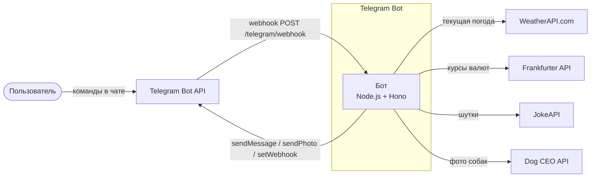

# Контекст системы

Telegram-бот (курс / погода / шутки / собаки): пользователь общается через Telegram, бот ходит во внешние API.

```mermaid
flowchart LR
  user(["Пользователь"])

  subgraph system["Telegram Bot"]
    bot["Бот<br/>Node.js + Hono"]
  end

  telegram["Telegram Bot API"]
  weather["WeatherAPI.com"]
  frankfurter["Frankfurter API"]
  jokeapi["JokeAPI"]
  dogceo["Dog CEO API"]

  user -->|"команды в чате"| telegram
  telegram -->|"webhook POST /telegram/webhook"| bot
  bot -->|"sendMessage / sendPhoto / setWebhook"| telegram
  bot -->|"текущая погода"| weather
  bot -->|"курсы валют"| frankfurter
  bot -->|"шутки"| jokeapi
  bot -->|"фото собак"| dogceo
```
