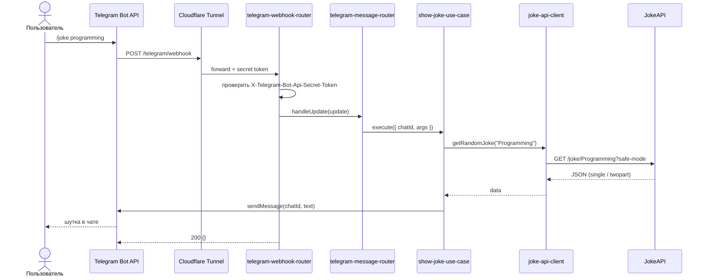

# Сценарий: обработка webhook

Пример потока для `/joke programming`.

```mermaid
sequenceDiagram
  actor User as Пользователь
  participant TG as Telegram Bot API
  participant Tunnel as Cloudflare Tunnel
  participant WH as telegram-webhook-router
  participant MR as telegram-message-router
  participant UC as show-joke-use-case
  participant Joke as joke-api-client
  participant API as JokeAPI

  User->>TG: /joke programming
  TG->>Tunnel: POST /telegram/webhook
  Tunnel->>WH: forward + secret token
  WH->>WH: проверить X-Telegram-Bot-Api-Secret-Token
  WH->>MR: handleUpdate(update)
  MR->>UC: execute({ chatId, args })
  UC->>Joke: getRandomJoke("Programming")
  Joke->>API: GET /joke/Programming?safe-mode
  API-->>Joke: JSON (single / twopart)
  Joke-->>UC: data
  UC->>TG: sendMessage(chatId, text)
  TG-->>User: шутка в чате
  WH-->>TG: 200 {}
```
